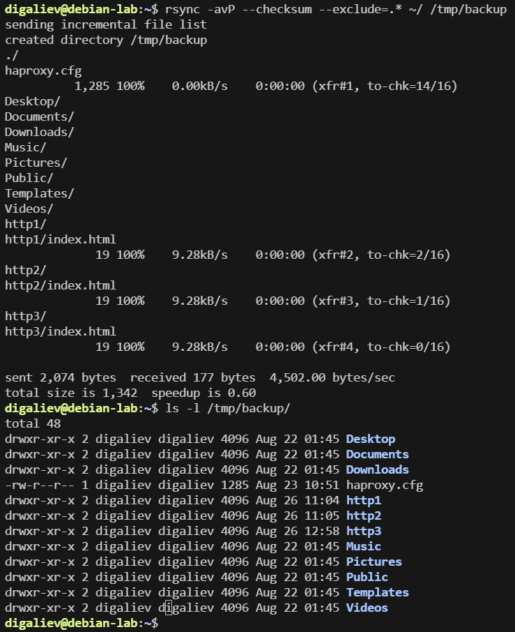
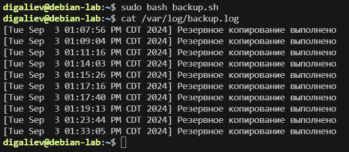

# Домашнее задание к занятию 3 «Резервное копирование» Галиев Д.Ф.

------

## Задание 1
- Составьте команду rsync, которая позволяет создавать зеркальную копию домашней директории пользователя в директорию `/tmp/backup`
- Необходимо исключить из синхронизации все директории, начинающиеся с точки (скрытые)
- Необходимо сделать так, чтобы rsync подсчитывал хэш-суммы для всех файлов, даже если их время модификации и размер идентичны в источнике и приемнике.
- На проверку направить скриншот с командой и результатом ее выполнения

### Решение 1

>rsync -avP --checksum --exclude=.* ~/ /tmp/backup



---

## Задание 2
- Написать скрипт и настроить задачу на регулярное резервное копирование домашней директории пользователя с помощью rsync и cron.
- Резервная копия должна быть полностью зеркальной
- Резервная копия должна создаваться раз в день, в системном логе должна появляться запись об успешном или неуспешном выполнении операции
- Резервная копия размещается локально, в директории `/tmp/backup`
- На проверку направить файл crontab и скриншот с результатом работы утилиты.

### Решение 2
[backup.sh](./backup.sh)

```bash
#!/bin/bash

SOURCE_DIR="/home/digaliev"
TARGET_DIR="/tmp/backup"

rsync -a --checksum "$SOURCE_DIR" "$TARGET_DIR" > /dev/null 2>> /var/log/backup.log
if [ $? -eq 0 ]; then
 echo "[$(date)] Резервное копирование выполнено" >> /var/log/backup.log
else
 echo "[$(date)] Ошибка выполнения резервного копирования" >> /var/log/backup.log
fi
```


/var/spool/cron/crontabs/backup
```
0 0 * * * /home/night/backup.sh
```

---
