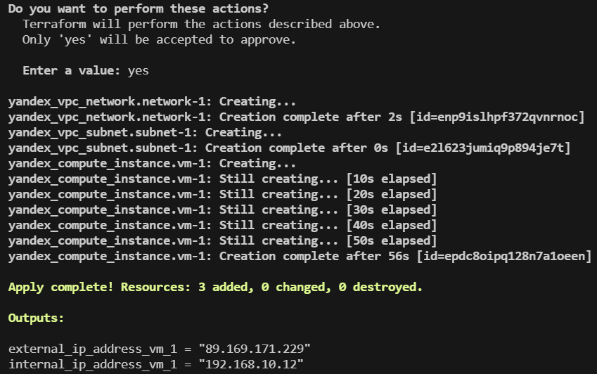
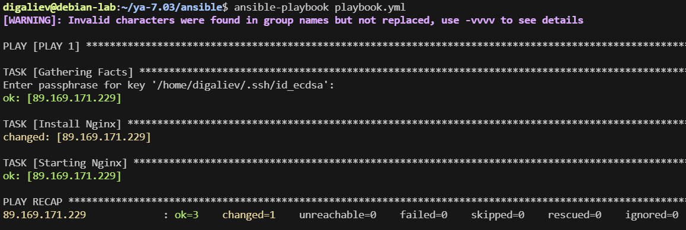
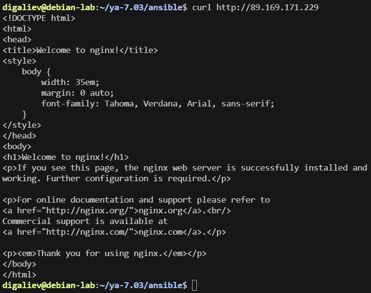

# Домашнее задание к занятию «Подъём инфраструктуры в Yandex Cloud» Галиев Д.Ф.

---

## Задание 1 

**Выполните действия, приложите скриншот скриптов, скриншот выполненного проекта.**

От заказчика получено задание: при помощи Terraform и Ansible собрать виртуальную инфраструктуру и развернуть на ней веб-ресурс. 

В инфраструктуре нужна одна машина с ПО ОС Linux, двумя ядрами и двумя гигабайтами оперативной памяти. 

Требуется установить nginx, залить при помощи Ansible конфигурационные файлы nginx и веб-ресурса. 

Секретный токен от yandex cloud должен вводится в консоли при каждом запуске terraform.

### Решение 2

#### Конфигурация terraform main.tf

```
erraform {
  required_providers {
    yandex = {
      source = "yandex-cloud/yandex"
    }
  }
}

provider "yandex" {
  zone      = "ru-central1-b"
}

resource "yandex_compute_instance" "vm-1" {
  name = "terraform1"

  resources {
    cores  = 2
    memory = 2
  }

  boot_disk {
    initialize_params {
      image_id = "fd87j6d92jlrbjqbl32q" # ubuntu 22.04
      size = 8
    }
  }

  network_interface {
    subnet_id = yandex_vpc_subnet.subnet-1.id
    nat       = true
  }

  metadata = {
    user-data = "${file("users.yml")}"
  }

}
resource "yandex_vpc_network" "network-1" {
  name = "network1"
}

resource "yandex_vpc_subnet" "subnet-1" {
  name           = "subnet1"
  zone           = "ru-central1-b"
  network_id     = yandex_vpc_network.network-1.id
  v4_cidr_blocks = ["192.168.10.0/24"]
}

output "internal_ip_address_vm_1" {
  value = yandex_compute_instance.vm-1.network_interface.0.ip_address
}
output "external_ip_address_vm_1" {
  value = yandex_compute_instance.vm-1.network_interface.0.nat_ip_address
}

```
#### user-data

```
cloud-config
users:
  - name: digaliev
    shell: /bin/bash
    sudo: ALL=(ALL) NOPASSWD:ALL
    ssh-authorized-keys:
     - ecdsa-sha2-nistp256 AAAAE2VjZHNhLXNoYTItbmlzdHAyNTYAAAAIbmlzdHAyNTYAAABBBJBhOkv2AqrOTS1KujzdggjxcDV+HldOgZqN0aQ/zJGftnOeSEmoMR8AlovseSR1KA8Z4uwKt3ZFCQbaZDIanH0= digaliev@debian-lab

```

#### Конфигурации Ansible:

```
- name: PLAY 1
  hosts: cloud-server
  become: yes
  tasks:
  - name: Install Nginx
    apt:
      name: nginx
      state: latest
  - name: Starting Nginx
    become: yes
    service:
      name: nginx
      state: started
      masked: no
```
#### Тестирование:
terraform apply:



Результат ansible-playbook:



Результат curl http://89.169.171.229




---

